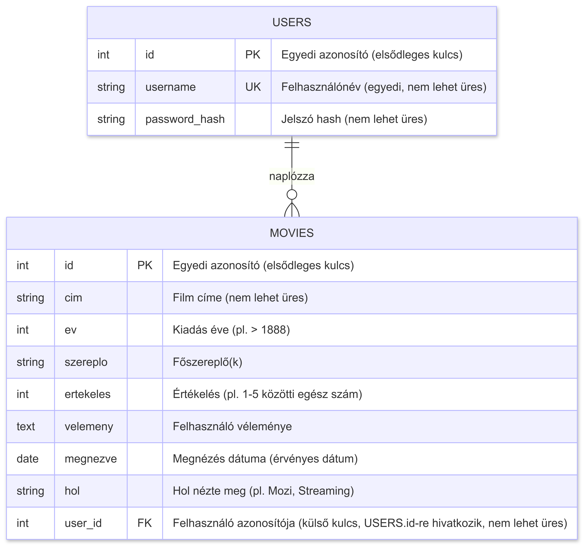

# Filmnapló Backend API Dokumentáció

## 1. Bevezetés

Ez a dokumentum a Filmnapló alkalmazás backend API-jának részletes leírását tartalmazza. Az API lehetővé teszi a felhasználók regisztrációját, bejelentkezését, valamint a filmek hozzáadását, listázását, módosítását és törlését.

## 2. Általános információk

### 2.1. Alap URL

Az API végpontok az alábbi alap URL-ről érhetők el:
`http://localhost:PORT/api`
A `PORT` értéke a `.env` fájlban vagy a környezeti változókban definiált portszám (alapértelmezetten 3000).

### 2.2. Környezeti változók

Az alkalmazás megfelelő működéséhez az alábbi környezeti változókat kell beállítani egy `.env` fájlban a projekt gyökérkönyvtárában:

* `PORT`: Az alkalmazás portszáma (pl. `3000`).
* `JWT_SECRET`: Egy titkos kulcs a JSON Web Tokenek (JWT) aláírásához és ellenőrzéséhez. Ennek hiányában az alkalmazás nem indul el.

Példa `.env` fájl:

```
PORT=3000
JWT_SECRET=nagyonTitkosKulcs123!
```

### 2.3. Autentikáció

Az API legtöbb végpontja autentikációt igényel. Az autentikáció JSON Web Token (JWT) alapú, amit a sikeres bejelentkezés után a szerver egy `authToken` nevű HTTP-only cookie-ban tárol el.

* **Token lejárata**: 3 óra.
* **Cookie beállítások**:
  * `httpOnly: true`: A cookie JavaScriptből nem érhető el, ami védelmet nyújt XSS támadások ellen.
  * `secure: process.env.NODE_ENV === 'production'`: Éles környezetben a cookie csak HTTPS kapcsolaton keresztül kerül továbbításra.
  * `sameSite: 'Lax'`: CSRF védelem.
  * `maxAge`: A cookie élettartama összhangban van a token lejáratával (3 óra).

Ha egy védett végpontot érvénytelen vagy hiányzó tokennel próbálnak elérni, a szerver `401 Unauthorized` vagy `403 Forbidden` státuszkóddal válaszol.

### 2.4. Kérés formátuma

Az API `application/json` formátumú kéréseket vár a `POST` és `PUT` metódusok esetén.

### 2.5. Válasz formátuma

A válaszok szintén `application/json` formátumúak. Sikeres művelet esetén általában `200 OK`, `201 Created` vagy `204 No Content` státuszkódot ad vissza. Hiba esetén a megfelelő HTTP státuszkódot (pl. `400`, `401`, `403`, `404`, `409`, `500`) és egy JSON objektumot ad vissza, ami tartalmaz egy `message` mezőt a hiba leírásával.

Példa sikeres válaszra:

```json
{
    "id": 1,
    "cim": "A film címe"
    // ... egyéb film adatok
}
```

Példa hibakezelés válaszra:

```json
{
    "message": "A film címe kötelező."
}
```

### 2.6. Hibakezelés

Az alkalmazás rendelkezik egy globális hibakezelővel, ami minden nem kezelt hibát elkap, naplózza a szerver konzoljára, és egy általános 500 Internal Server Error választ küld a kliensnek:

```json
{
    "message": "Szerverhiba történt!"
}
```

### 2.7. Middleware-ek

* cors(): Engedélyezi a cross-origin kéréseket.
* express.json(): Feldolgozza a JSON formátumú kéréstörzseket.
* cookieParser(): Lehetővé teszi a cookie-k olvasását és írását.

### 2.8. Adatbázis

Az alkalmazás better-sqlite3 könyvtárat használ egy SQLite adatbázissal (filmnaplo.db). A táblák (felhasznalok, filmek) automatikusan létrejönnek az alkalmazás első indításakor, ha még nem léteznek. A filmek tábla user_id oszlopa külső kulcsként hivatkozik a felhasznalok tábla id oszlopára, ON DELETE CASCADE opcióval, ami azt jelenti, hogy ha egy felhasználó törlődik, az összes hozzá tartozó film is törlődik

## 3. Adatmodellek

### 3.1. Felhasználó (`felhasznalok`)

| Mező       | Típus   | Leírás                                   | Megkötések                 |
| ---------- | ------- | ---------------------------------------- | -------------------------- |
| `id`       | INTEGER | Egyedi azonosító                         | PRIMARY KEY, AUTOINCREMENT |
| `username` | TEXT    | Felhasználónév                           | UNIQUE, NOT NULL           |
| `password` | TEXT    | Hash-elt jelszó (bcrypt, SALT_ROUNDS=10) | NOT NULL                   |

### 3.2. Film (`filmek`)

| Mező        | Típus   | Leírás                                             | Megkötések                                                |
| ----------- | ------- | -------------------------------------------------- | --------------------------------------------------------- |
| `id`        | INTEGER | Egyedi azonosító                                   | PRIMARY KEY, AUTOINCREMENT                                |
| `user_id`   | INTEGER | A felhasználó azonosítója                          | NOT NULL, FOREIGN KEY (felhasznalok.id) ON DELETE CASCADE |
| `cim`       | TEXT    | Film címe                                          | NOT NULL                                                  |
| `ev`        | INTEGER | Megjelenési év                                     | Opcionális                                                |
| `szereplok` | TEXT    | Szereplők listája (vesszővel elválasztva javasolt) | Opcionális                                                |
| `ertekeles` | INTEGER | Értékelés (1-5)                                    | Opcionális                                                |
| `velemeny`  | TEXT    | Felhasználói vélemény                              | Opcionális                                                |
| `megnezve`  | DATE    | Megnézés dátuma ('YYYY-MM-DD' formátum)            | Opcionális (ha `NULL`, még nem nézte meg)                 |
| `hol`       | TEXT    | Hol nézte meg (pl. Netflix, mozi)                  | Opcionális                                                |



## 4. Felhasználói végpontok (`/api/users`)

### 4.1. Regisztráció

* **Útvonal**: `POST /api/users/register`

* **Leírás**: Új felhasználó regisztrálása.

* **Autentikáció**: Nem szükséges.

* **Kérés törzse**:
  
  ```json
  {
      "username": "string",
      "password": "string"
  }
  ```

* **Validáció**:
  
  * `username`: Kötelező.
  * `password`: Kötelező, minimum 6 karakter hosszú.

* **Sikeres válasz (201 Created)**:
  
  ```json
  {
      "message": "Sikeres regisztráció.",
      "userId": "integer" // Az újonnan létrehozott felhasználó ID-ja
  }
  ```

* **Hiba válaszok**:
  
  * `400 Bad Request`: `{"message": "Felhasználónév és jelszó megadása kötelező."}`
  * `400 Bad Request`: `{"message": "A jelszónak legalább 6 karakter hosszúnak kell lennie."}`
  * `409 Conflict`: `{"message": "A felhasználónév már foglalt."}`
  * `500 Internal Server Error`: `{"message": "Szerverhiba a regisztráció során."}`

### 4.2. Bejelentkezés

* **Útvonal**: `POST /api/users/login`

* **Leírás**: Felhasználó bejelentkeztetése és autentikációs token generálása.

* **Autentikáció**: Nem szükséges.

* **Kérés törzse**:
  
  ```json
  {
      "username": "string",
      "password": "string"
  }
  ```

* **Validáció**:
  
  * `username`: Kötelező.
  * `password`: Kötelező.

* **Sikeres válasz (200 OK)**:
  
  * Beállítja az `authToken` HTTP-only cookie-t.
    
    ```json
    {
    "message": "Sikeres bejelentkezés.",
    "user": {
        "id": "integer",
        "username": "string"
    }
    }
    ```

* **Hiba válaszok**:
  
  * `400 Bad Request`: `{"message": "Felhasználónév és jelszó megadása kötelező."}`
  * `401 Unauthorized`: `{"message": "Hibás felhasználónév vagy jelszó."}`
  * `500 Internal Server Error`: `{"message": "Szerverhiba a bejelentkezés során."}`

### 4.3. Kijelentkezés

* **Útvonal**: `POST /api/users/logout`

* **Leírás**: Felhasználó kijelentkeztetése az autentikációs token cookie törlésével.

* **Autentikáció**: Nem szükséges (de a cookie-t törli, ha létezik).

* **Kérés törzse**: Nincs.

* **Sikeres válasz (200 OK)**:
  
  * Törli az `authToken` cookie-t.
    
    ```json
    {
    "message": "Sikeres kijelentkezés."
    }
    ```
    
## 5. Film végpontok (`/api/movies`)

Minden filmekkel kapcsolatos végpont autentikációt igényel.

### 5.1. Film adatok validálása (`validateMovieData` segédfüggvény)

Ez a szerveroldali segédfüggvény a filmek hozzáadásakor és módosításakor ellenőrzi a beküldött adatokat.

* `cim` (string):
  * Új film hozzáadásakor (`isNewMovie = true`) kötelező.
* `ertekeles` (number):
  * Ha meg van adva (nem `undefined`, nem `null`), akkor 1 és 5 közötti egész számnak kell lennie.
  * Hibaüzenet: `Az értékelésnek 1 és 5 közötti számnak kell lennie.`
* `ev` (number):
  * Ha meg van adva (nem `undefined`, nem `null`), akkor 1900 és (aktuális év + 10) közötti számnak kell lennie.
  * Hibaüzenet: `Érvénytelen megjelenési év.`
* `megnezve` (string):
  * Ha meg van adva (nem `undefined`, nem `null`, és nem üres string), akkor érvényes `YYYY-MM-DD` formátumú dátumnak kell lennie (pl. nem "2023-02-30").
  * Hibaüzenetek: `A megnézés dátuma érvénytelen formátumú (YYYY-MM-DD).` vagy `A megnézés dátuma érvénytelen (pl. február 30).`

### 5.2. Új film hozzáadása

* **Útvonal**: `POST /api/movies`

* **Leírás**: Új film hozzáadása a bejelentkezett felhasználó gyűjteményéhez.

* **Autentikáció**: Szükséges.

* **Kérés törzse**:
  
  ```json
  {
      "cim": "string", // Kötelező
      "ev": "integer | null",
      "szereplok": "string | null",
      "ertekeles": "integer | null", // 1-5
      "velemeny": "string | null",
      "megnezve": "string ('YYYY-MM-DD') | null",
      "hol": "string | null"
  }
  ```

* **Sikeres válasz (201 Created)**: A létrehozott film objektum.
  
  ```json
  {
      "id": "integer",
      "user_id": "integer",
      "cim": "string",
      "ev": "integer | null",
      "szereplok": "string | null",
      "ertekeles": "integer | null",
      "velemeny": "string | null",
      "megnezve": "string ('YYYY-MM-DD') | null",
      "hol": "string | null"
  }
  ```

* **Hiba válaszok**:
  
  * `400 Bad Request`: Validációs hiba (lásd 5.1. szakasz).
  * `401 Unauthorized`: `{"message": "Hiányzó autentikációs token."}`
  * `403 Forbidden`: `{"message": "Érvénytelen vagy lejárt token."}`
  * `500 Internal Server Error`: `{"message": "Szerverhiba történt a film hozzáadásakor."}`

### 5.3. Filmek listázása

* **Útvonal**: `GET /api/movies`

* **Leírás**: A bejelentkezett felhasználó összes filmjének listázása. A filmek a `megnezve` dátum szerint csökkenő sorrendben kerülnek visszaadásra.

* **Autentikáció**: Szükséges.

* **Kérés törzse**: Nincs.

* **Sikeres válasz (200 OK)**: Film objektumok tömbje.
  
  ```json
  [
      { /* Film objektum 1 */ },
      { /* Film objektum 2 */ }
      // ...
  ]
  ```

* **Hiba válaszok**:
  
  * `401 Unauthorized`: `{"message": "Hiányzó autentikációs token."}`
  * `403 Forbidden`: `{"message": "Érvénytelen vagy lejárt token."}`
  * `500 Internal Server Error`: `{"message": "Szerverhiba történt a filmek listázásakor."}`

### 5.4. Egy konkrét film lekérése

* **Útvonal**: `GET /api/movies/:id`
* **Leírás**: Egy konkrét film adatainak lekérése azonosító alapján, amennyiben az a bejelentkezett felhasználóhoz tartozik.
* **Autentikáció**: Szükséges.
* **Útvonal paraméter**: `id` (integer) - A film egyedi azonosítója.
* **Kérés törzse**: Nincs.
* **Sikeres válasz (200 OK)**: A kért film objektum.
* **Hiba válaszok**:
  * `400 Bad Request`: `{"message": "Érvénytelen film azonosító."}` (ha `:id` nem szám)
  * `401 Unauthorized`: `{"message": "Hiányzó autentikációs token."}`
  * `403 Forbidden`: `{"message": "Érvénytelen vagy lejárt token."}`
  * `404 Not Found`: `{"message": "Film nem található vagy nincs jogosultságod megtekinteni."}`
  * `500 Internal Server Error`: `{"message": "Szerverhiba történt a film lekérésekor."}`

### 5.5. Film adatainak módosítása

* **Útvonal**: `PUT /api/movies/:id`

* **Leírás**: Egy meglévő film adatainak módosítása. Csak a kérés törzsében megadott mezők frissülnek.

* **Autentikáció**: Szükséges.

* **Útvonal paraméter**: `id` (integer) - A módosítandó film egyedi azonosítója.

* **Kérés törzse**: Opcionális mezők, melyek a film objektum bármely módosítható tulajdonságát tartalmazhatják (lásd 5.2. szakasz kérés törzse, de a `cim` itt nem kötelező).
  
  ```json
  {
      "cim": "string | null",
      "ev": "integer | null",
      // ... stb.
  }
  ```

* **Sikeres válasz (200 OK)**: A frissített film objektum.

* **Hiba válaszok**:
  
  * `400 Bad Request`: `{"message": "Érvénytelen film azonosító."}`
  * `400 Bad Request`: Validációs hiba (lásd 5.1. szakasz).
  * `401 Unauthorized`: `{"message": "Hiányzó autentikációs token."}`
  * `403 Forbidden`: `{"message": "Érvénytelen vagy lejárt token."}`
  * `404 Not Found`: `{"message": "Film nem található vagy nincs jogosultságod módosítani."}`
  * `500 Internal Server Error`: `{"message": "Szerverhiba történt a film frissítésekor."}`
  * Ha a kérés törzse üres vagy nem tartalmaz frissítendő mezőt, a szerver `200 OK` státusszal és a film aktuális adataival válaszol.

### 5.6. Film törlése

* **Útvonal**: `DELETE /api/movies/:id`
* **Leírás**: Egy film törlése azonosító alapján, amennyiben az a bejelentkezett felhasználóhoz tartozik.
* **Autentikáció**: Szükséges.
* **Útvonal paraméter**: `id` (integer) - A törlendő film egyedi azonosítója.
* **Kérés törzse**: Nincs.
* **Sikeres válasz (204 No Content)**: Nincs válasz törzs.
* **Hiba válaszok**:
  * `400 Bad Request`: `{"message": "Érvénytelen film azonosító."}`
  * `401 Unauthorized`: `{"message": "Hiányzó autentikációs token."}`
  * `403 Forbidden`: `{"message": "Érvénytelen vagy lejárt token."}`
  * `404 Not Found`: `{"message": "A film nem található vagy nincs jogosultságod törölni."}`
  * `500 Internal Server Error`: `{"message": "Szerverhiba történt a film törlésekor."}`

## Manuális tesztelés

Ha az adatbázis már tartalmaz megőrzendő adatokat, akkor az adatbázisfájlt a tesztek futtatása előtt célszerű átnevezni. A server.js induláskor létrehoz egy új, üres adatbázist. Később vissza lehet állítani az eredeti adatbázisfájlt.

A felhasználókkal kapcsolatos végpontok tesztjei az ***api_teszt1.http*** fájlban találhatók.

**Fontos!**

A regisztrációs tesztek (különösen az 5. teszt, ami a már létező felhasználónevet ellenőrzi) függnek az adatbázis aktuális állapotától. Ha többször futtatjuk a teszteket, előfordulhat, hogy a "testuser_reg" felhasználó már létezik. Ilyenkor vagy törölni kell a `filmnaplo.db` fájlt (a szerver újraindításakor új, üres adatbázis jön létre), vagy minden tesztfuttatás előtt egyedi felhasználóneveket kell használni.

A filmekkel kapcsolatos végpontok az ***api_teszt2.http*** fájlban találhatók.

**Magyarázat a tesztfájlhoz:**

* **Változók (`@host`, `@testUsername`, `@testPassword` )**: Globális változók a kérések egyszerűsítésére.
* **`@createdMovieId`**: Ezt a változót az első sikeres film létrehozási kérés (`addMovieSuccess`) válaszából töltjük fel.
* **`# @name requestName`**: Ez a sor elnevezi a kérést.
* **Sorrend**:
  1. Először regisztrálunk egy teszt felhasználót.
  2. Majd bejelentkezünk vele, hogy megkapjuk cookie-ban az `authToken`-t.
  3. Ezután következnek a filmekkel kapcsolatos tesztek, amelyek már használják ezt a tokent és a létrehozott film ID-ját.
